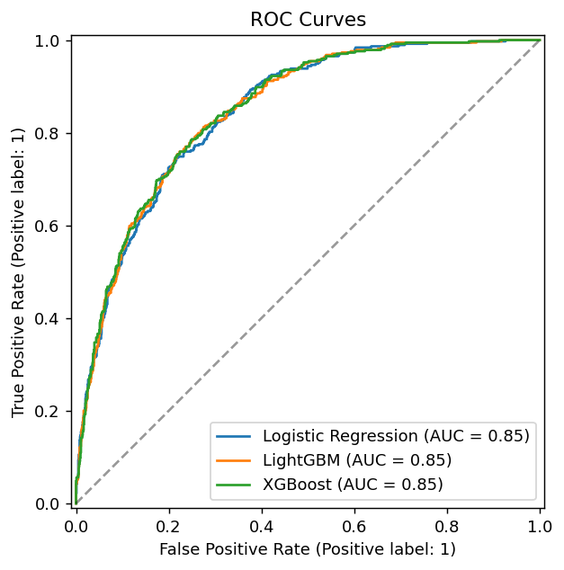
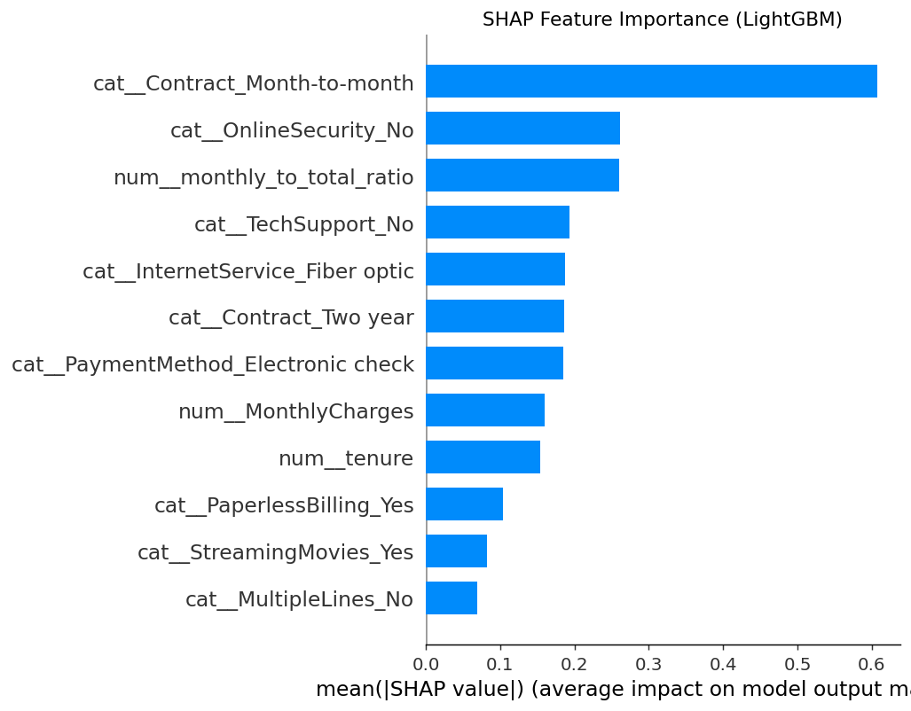
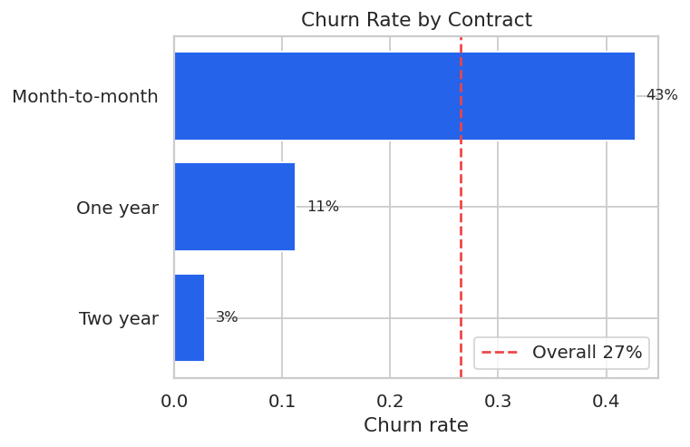
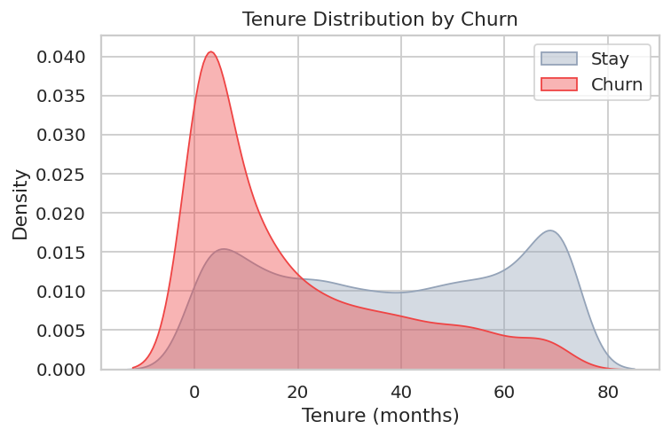

# 📡 TelcoCare AI — Churn Prediction & RAG Retention Assistant

Predict which telecom customers are likely to **churn**, explain *why*, and give retention
agents an **LLM assistant** that turns the model's output plus internal policy documents into
a concrete, compliant action plan.

**TR —** Bir telekom operatöründe hangi müşterilerin aboneliğini bırakmaya (churn) yakın
olduğunu tahmin eden, bunun *nedenini* açıklayan ve elde tutma ekibine bir **LLM asistanı**
veren uçtan uca bir proje. Asistan, modelin çıktısını ve şirket içi politika belgelerini alıp
müşteri temsilcisine somut ve kurallara uygun bir aksiyon planına dönüştürüyor. Kısaca: skoru
kod hesaplar, nedenini SHAP açıklar, ne yapılacağını da asistan söyler.


-black)


---

## 🤖 TelcoCare AI: from a score to an action

A churn probability on its own doesn't tell a call-centre agent what to actually say to the
customer. TelcoCare AI ties three pieces together to close that gap:

```
                ┌───────────────────────── Streamlit UI ─────────────────────────┐
                │  customer score + SHAP drivers    │    chat + tool-call trace  │
                └──────────────┬────────────────────┴──────────────┬─────────────┘
                               │ REST                              │ REST
                         ┌─────▼──────────────── FastAPI ──────────▼─────┐
                         │ /predict/{id}   /predict   /customers   /chat │
                         └─────┬───────────────────────────────────┬─────┘
                               │                                   │
                  ┌────────────▼───────────┐          ┌────────────▼─────────────┐
                  │ ChurnPredictor         │◄─tool────│ RetentionAgent           │
                  │ XGBoost pipeline       │          │ tool-calling loop        │
                  │ + native SHAP per user │          │ (max 5 steps)            │
                  └────────────────────────┘          └───┬──────────────────┬───┘
                                                          │ tool             │ chat
                                               ┌──────────▼─────────┐  ┌─────▼──────────┐
                                               │ FAISS vector store │  │ Ollama (local) │
                                               │ multilingual mpnet │  │ qwen2.5:3b     │
                                               │ tariffs, campaigns,│  └────────────────┘
                                               │ playbook, FAQ      │
                                               └────────────────────┘
```

| Component | What it does | Key choices |
|---|---|---|
| **Predictor** (`src/serving`) | Scores a customer and returns the top drivers | SHAP from the booster's native `pred_contribs`; one-hot columns folded back into readable features |
| **RAG** (`src/rag`) | Retrieves tariff, campaign and policy passages | Heading-aware chunking; multilingual embeddings so **Turkish questions match English documents**; cosine search with FAISS |
| **Agent** (`src/agent`) | Routes the question, runs tools, lets the LLM explain, renders facts | 6 tools; deterministic router and rules engine; post-processing that renders every number from code; bounded step budget |
| **API** (`api/`) | FastAPI with Pydantic validation, timing middleware, `/health` for model and LLM | `/predict` works without the LLM; the agent loads lazily |
| **MLOps** | MLflow tracking and model registry, pytest, GitHub Actions, Docker Compose | Tests use a scripted fake LLM and a hashing embedder, so CI needs no GPU, Ollama or downloads |

The knowledge base (`knowledge_base/`) is a set of synthetic documents for a fictional
operator called NovaTel, so none of it is real customer or company data.

**Example.** *"Why is customer 9237-HQITU at risk and what should I offer?"*
→ `predict_churn` (high risk: month-to-month, fiber, electronic check)
→ `search_knowledge_base("month-to-month fiber electronic check retention offer")`
→ the agent answers with RET-LOCK24 + RET-AUTOPAY, checks the stacking and 35% discount
rules, and cites `[retention_campaigns.md]`.

### How reliable is it? (evaluation-driven development)

A 3B local model can't be trusted with numbers, eligibility rules or tool choice, so I built
the agent against an automatic eval harness and iterated on it **20 times**, writing down every
run as I went (including the bugs in my own grader: [`eval/ITERATIONS.md`](eval/ITERATIONS.md)).
Three separate case sets keep me honest: **dev** for tuning, **held-out** to catch overfitting,
and a **test** set I left untouched until the system was frozen.

| stage | set | case pass | median latency |
|---|---|---|---|
| first harness run | dev | 25% | 22 s |
| deterministic router | dev | 75% | 14 s |
| code-rendered campaigns | dev | 100% | 10 s |
| same system, **new questions** | held-out | **67%** ← overfitting | 10 s |
| structural routing + hybrid RAG | held-out | 96% | 10 s |
| first run of the **unseen test set** | test | **87.5%** | 9.6 s |
| final (strict checks on the assistant's own text) | dev / held-out / test* | 100% / 100% / 96% | 6-9 s |

<sub>*The test set influenced fixes after its first run, so the final test number is no longer an unseen estimate.
Checks include: grounded numbers, no reasoning leaks, answer language and script, faithful campaign details.</sub>

qwen2.5:7b was just as accurate but four times slower, and qwen3:4b kept leaking its reasoning into
the reply, so **qwen2.5:3b** stayed the default. What's still shaky is the Turkish phrasing in
free-text answers, not the facts underneath.

**What made it reliable: code decides and renders the facts, the LLM only explains.**
- *Routing by entities*: a customer ID, a campaign code or a ranking request picks the tool before the LLM even runs.
- *Rules engine* (`src/agent/campaigns.py`): eligibility, stacking and ranking by SHAP drivers.
- *Deterministic rendering*: the risk line, campaign offers, eligibility verdicts and ranking tables come from code. LLM lines containing numbers are dropped on customer cards.
- *Retrieval*: multilingual mpnet + BM25 with coverage-scaled RRF, and an adaptive relevance cut so the LLM sees ~1.85 passages (`eval/compare_embeddings.py`: hit@1 0.85, MRR 0.885).
- *Guards*: generation cap (a 14k-token loop was the original "hang"), empty-reply and script-drift retries (Qwen sometimes switched to Chinese), canned answers for unknown customers and eligibility checks, removal of invented links, currency repair, a quoted source excerpt under knowledge-base answers.

```bash
python -m eval.eval_agent --set heldout --repeats 3 --tag mytest
python -m eval.eval_retrieval
```

### Run it locally

```bash
python -m venv .venv && .venv\Scripts\activate
pip install torch --index-url https://download.pytorch.org/whl/cpu
pip install -r requirements.txt

python train.py                     # train + log to MLflow (sqlite:///mlflow.db)
python -m src.rag.ingest            # build the FAISS index
ollama pull qwen2.5:3b              # default; override with OLLAMA_MODEL

uvicorn api.main:app --reload       # http://localhost:8000/docs
streamlit run app/streamlit_app.py  # http://localhost:8501
mlflow ui --backend-store-uri sqlite:///mlflow.db
pytest -q
```

Or run everything in containers: `docker compose up --build`.

---

## 🎯 Churn model: background

A telecom company loses revenue every time a customer leaves, and keeping an existing
customer is far cheaper than acquiring a new one. This project builds an interpretable,
tuned churn model on the IBM Telco dataset (7,043 customers) and turns the findings into
concrete retention actions.

Only **~27% of customers churn**, so this is an **imbalanced** problem. Plain accuracy is
misleading, so I evaluate on **ROC-AUC, PR-AUC, recall and F1**, with class weighting to
prioritise catching churners.

## 📊 Results

Tuned with **Optuna** (5-fold cross-validation on ROC-AUC), evaluated on a held-out 20%
test set:

| Model | ROC-AUC | Recall | Precision | F1 |
|-------|:-------:|:------:|:---------:|:--:|
| Logistic Regression (baseline) | 0.846 | 0.783 | 0.505 | 0.614 |
| LightGBM (tuned) | 0.848 | 0.805 | 0.515 | 0.628 |
| **XGBoost (tuned)** | **0.850** | 0.797 | 0.515 | 0.625 |

**Best model: XGBoost — holdout ROC-AUC 0.850, PR-AUC 0.663.** At the default 0.50
threshold it catches ~80% of churners; the F1-optimal threshold (~0.63) trades some recall
for precision.

<p align="center">
  
  
</p>

### What actually moved the needle (honest write-up)

I ran a broad search (LightGBM / XGBoost / CatBoost, 40–150 Optuna trials each) and found
this dataset tops out around **~0.85 ROC-AUC**. The useful lessons:

- **Hyperparameter tuning was the biggest lever** (~+0.013 over the untuned booster);
  feature engineering added a little more.
- **Model choice barely mattered** — LightGBM, XGBoost and CatBoost land within 0.001.
- **SMOTE hurt** (0.835 vs 0.837 for `scale_pos_weight`), and a 3-model **ensemble did not
  beat the single best model**.

I think showing *where the ceiling is* and *what doesn't work* is more honest — and more
useful — than chasing a fake accuracy jump.

## 🔑 Key findings

- **Contract type is the strongest driver.** Month-to-month customers churn at **~43%**
  vs **~3%** for two-year contracts.
- **Churn peaks early** — most churn happens in the first months of tenure.
- **Missing add-ons hurt** — customers without *online security* or *tech support* churn more.
- **Payment friction matters** — electronic-check users churn more than auto-pay users.

<p align="center">
  
  
</p>

## 💡 Business recommendations

| Finding | Suggested action |
|---|---|
| Month-to-month churn ~43% | Incentivise 1–2 year contracts with a switching discount |
| Churn peaks in first months | Onboarding programme + early check-ins for new customers |
| No security / tech support → more churn | Bundle or offer free trials of these services |
| Electronic-check users churn more | Nudge customers toward automatic payments |

## 🗂️ Project structure

```
telco-churn-analysis/
├── data/
│   └── raw/telco_churn.csv        # source dataset
├── notebooks/
│   └── 01_churn_analysis.ipynb    # full story (bilingual TR/EN): EDA → tuning → SHAP
├── src/                           # reusable, importable modules
│   ├── config.py                  # paths, columns, tuned hyperparameters
│   ├── data.py                    # load + clean
│   ├── features.py                # feature engineering + preprocessing pipeline
│   ├── model.py                   # LogReg + tuned LightGBM + tuned XGBoost
│   ├── tune.py                    # Optuna hyperparameter search (reproducible)
│   ├── evaluate.py                # metrics & plots
│   ├── eda.py                     # EDA figure generation
│   └── explain.py                 # SHAP explainability
├── src/serving/predictor.py       # per-customer scoring + SHAP drivers
├── src/rag/                       # chunking, FAISS vector store, ingest CLI
├── src/agent/                     # Ollama client, tools, tool-calling agent
├── api/main.py                    # FastAPI service
├── app/streamlit_app.py           # agent-facing UI
├── knowledge_base/                # synthetic tariff / campaign / policy docs
├── tests/                         # pytest (fake LLM, no downloads)
├── Dockerfile, docker-compose.yml # api + ui + ollama
├── .github/workflows/ci.yml       # train → test → docker build
├── models/                        # saved best model + metrics.json (generated)
├── reports/figures/               # all figures (generated)
├── train.py                       # end-to-end: clean → engineer → train → evaluate
├── requirements.txt
└── README.md
```

## 🚀 Getting started

```bash
git clone https://github.com/derinteke/telco-churn-analysis.git
cd telco-churn-analysis

python -m venv venv
source venv/bin/activate            # Windows: venv\Scripts\activate
pip install -r requirements.txt

# Train & evaluate all three models (writes models/ and reports/figures/)
python train.py

# Reproduce the hyperparameter search
python -m src.tune --model xgboost --trials 50

# Regenerate EDA / SHAP figures
python -m src.eda
python -m src.explain

# Explore the notebook
jupyter notebook notebooks/01_churn_analysis.ipynb
```

## 🛠️ Methodology

1. **Cleaning** — fix `TotalCharges` (text with blanks for tenure-0 customers) and make
   `SeniorCitizen` categorical.
2. **Feature engineering** — number of services, tenure bands, spend-per-tenure, internet
   flag, monthly/total ratio.
3. **Preprocessing** — a scikit-learn `ColumnTransformer` (scaling + one-hot) lives *inside*
   each `Pipeline`, so there is **no data leakage** and the saved model accepts raw input.
4. **Modeling & tuning** — LogReg baseline + LightGBM/XGBoost tuned with **Optuna** under
   5-fold CV; class imbalance handled with `scale_pos_weight` / `class_weight`.
5. **Evaluation** — stratified split, ROC-AUC / PR-AUC / recall / F1, confusion matrices,
   ROC curves, and **decision-threshold tuning**.
6. **Explainability** — SHAP values expose global feature importance.

## 🔭 Possible extensions

- Cost-sensitive threshold selection driven by campaign budget and customer lifetime value.
- LLM-as-judge (with a stronger model) to catch misattributed sentences that regex checks miss.
- DVC for data and model versioning; drift monitoring on incoming customer data.

## 📄 License

MIT — feel free to use and adapt.
